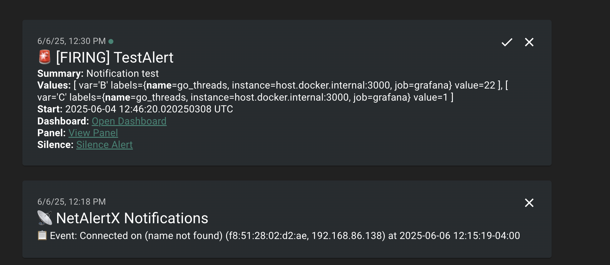

## Introduction

Last week, I found myself pondering what kind of project I could tackle next in my homelab. One piece of technology I hadn’t really explored yet was [RabbitMQ](https://www.rabbitmq.com/). We use it at work, but my team doesn’t directly own it. Unlike some other technologies, like Kubernetes (k8s), [ArgoCD](https://argo-cd.readthedocs.io/), or [Grafana](https://grafana.com), figuring out a use case for RabbitMQ in my small homelab was a bit challenging.

So, I did what anyone does nowadays: I asked AI.

One of the ideas it pitched caught my attention—using RabbitMQ as a central hub for all my alerts. Currently, each tool in my homelab sends notifications to the providers I specify. [Uptime-Kuma](https://github.com/louislam/uptime-kuma) posts to Mattermost and [Ntfy](https://ntfy.sh), while [Netalerx](https://netalerx.com) posts only to Ntfy. AI's suggestion was to have all these tools send their alerts to RabbitMQ, which would then dispatch them to the appropriate destinations, mainly Ntfy.

Initially, I thought, "Great, I'll just have Rabbit send the alerts, and that will simplify things." But that’s obviously not how RabbitMQ, or many pub-sub tools like it—work. You need a service to pick up messages from the queue. AI suggested building my own service for this purpose.

I thought: "Okay, so deploy RabbitMQ and build a service. That’s a decent challenge."

But then I hit another snag. Most of these tools can’t post directly to RabbitMQ due to protocol limitations. I’d need something sitting in front of RabbitMQ to handle this. AI suggested building another service for this purpose. At this point, I started questioning the entire plan, but I decided to give it a go anyway.

### Step 1: Deploying RabbitMQ

My preference is to deploy everything in my homelab to my k3s Kubernetes cluster whenever possible. I don’t run everything there—some things are on VMs with [Podman](https://podman.io/), others as LXC containers via [Proxmox helper scripts](https://community-scripts.github.io/ProxmoxVE/). Surprisingly, I couldn’t find a lot of resources on deploying RabbitMQ to k8s. AI suggested using the Bitnami image, so I went with that.

I set everything up for ArgoCD, which I use for GitOps. That’s when I hit my first roadblock. Initially, I was using the Helm chart hosted at [https://charts.bitnami.com/bitnami](https://charts.bitnami.com/bitnami), but I kept getting errors.

After some digging, I discovered that Bitnami had moved to OCI. I updated the repo in ArgoCD, and while it successfully connected, I kept running into the error:

```
"not a valid chart repository or cannot be reached: object required."
```

It took me about 30mins of head-scratching to figure out the issue. It turns out that when using OCI images in ArgoCD, you don’t include the oci:// prefix in the repoURL. The correct configuration was simply:

```yaml
repoURL: registry-1.docker.io/bitnamicharts
```

Once that was squared away, the app deployed without further issues.

### Step 2: Building the Message Dispatcher

Next, I needed to build a service to pick up messages from RabbitMQ and deliver them. I chose Python because, as a non-developer, I’m most comfortable with it. I found a library called [pika](https://pika.readthedocs.io/en/stable/) for handling RabbitMQ in Python.

Over the next day (with a lot of help from AI), I built a service I named Notifiq (notice + queue). You can find it on GitHub: [https://github.com/timmyb824/notifiq](https://github.com/timmyb824/notifiq).

Notifiq is a service that consumes messages from a RabbitMQ queue (plans to support multiple queues) and delivers them to specified providers based on the JSON payload. I used the [Apprise](https://pypi.org/project/apprise/) library for notifications, which supports a ton of providers. While the extensibility was great, Apprise caused a major headache down the road (more on that later).

To test Notifiq, I wrote a simple [script](https://raw.githubusercontent.com/timmyb824/notifiq/refs/heads/main/scripts/send_test_notification.py) that posts messages to RabbitMQ. It worked like a charm.

### Step 3: Getting Messages into RabbitMQ

Now came the challenge of getting messages from my tools into RabbitMQ. AI suggested building another service for this, but that felt like _real_ overkill. While separating concerns makes sense in a production environment, managing more services in a homelab isn’t always ideal.

Then I remembered I already had [n8n](https://n8n.io) running in my cluster, a low-code automation tool I hadn’t really used much. With its webhook node, it seemed like a great candidate for this task.

For each tool (since they have different payload formats), I created an n8n workflow:

**Webhook Node:** Receives the alert.

**Set/Edit Node:** Parses the payload into a `title`, `message`, and fields required by Notifiq (e.g., ntfy topic, destination provider).

**RabbitMQ Node:** Sends the parsed message to RabbitMQ.

The first two tools were easy to set up. Then came [Grafana](https://grafana.com), and this is where things got a bit messy.

#### The Grafana Payload Nightmare

Grafana's alert payloads can be big. While I could create templates and control them within Grafana, for testing, I had it post the entire payload to n8n so I could inspect it. Using n8n, I extracted the necessary fields, built the message, and sent it to Ntfy (my central hub for all alerts).

However, the Grafana alerts looked terrible in Ntfy. I discovered that Ntfy supports Markdown if you pass the `X-Markdown: true` header. I tried setting this up in Notifiq, but no matter what I did, the Markdown wouldn’t render.

I spent an hour troubleshooting this. AI was no help. Eventually, I realized the problem: [Apprise](https://github.com/caronc/apprise) doesn’t support sending custom headers.

To fix this, I wrote a new Notifiq module called `ntfy-direct`, which bypasses Apprise and sends messages to Ntfy directly. Even then, I ran into issues with emojis in the titles. AI suggested removing them, but I refused since I had designed my alerts to use specific emojis for quick identification.

Finally, I figured out the root cause:

As ChatGPT explained, _"the issue was how the `requests` library encodes headers. It uses ISO-8859-1 (latin-1) encoding for HTTP headers, which doesn’t support Unicode characters like emojis. The solution was to switch to the `httpx` library, which uses UTF-8 encoding for headers, supporting full Unicode."_

With that, Markdown rendering worked perfectly, emojis and all.

### Step 4: Final Touches

The last step was setting up workflows for my remaining tools and automation scripts. For example, I have a script that alerts me about upcoming bills and another that tracks mortgage rates. Most of these were straightforward to integrate.

I did run into one more hiccup with my mortgage rate scraper. It sends multiple rates in its payload, separated by line breaks, which n8n struggled to parse. After trying various fixes, I solved this by using manual mapping in n8n’s Set node instead of pure expressions.

For emoji control, I used this simple expression in n8n:

```javascript
{
  {
    $json.body.title.includes("Mortgage")
      ? "🏠 " + $json.body.title
      : $json.body.title.includes("Bills")
      ? "💵 " + $json.body.title
      : $json.body.title;
  }
}
```

### The Final Flow

After all that, my alert flow now looks like this:

**Tool/Script** → **n8n Workflow** → **RabbitMQ** → **Notifiq** → **Ntfy (or other providers)**

And here’s what it looks like in Ntfy:



### Conclusion

In the end, the actual RabbitMQ setup was the easiest part. Most of the challenges came from the pieces surrounding it. Still, everything ties back to RabbitMQ, and learning to work with it was the whole point of this overly complicated setup.

So, was it worth it? I think so—but only time will tell. If it turns out not to be, I can always fall back to my previous setup. Either way, the process taught me a lot, and at the end of the day, overcomplicating things in the name of learning is what homelab-ing is all about.
