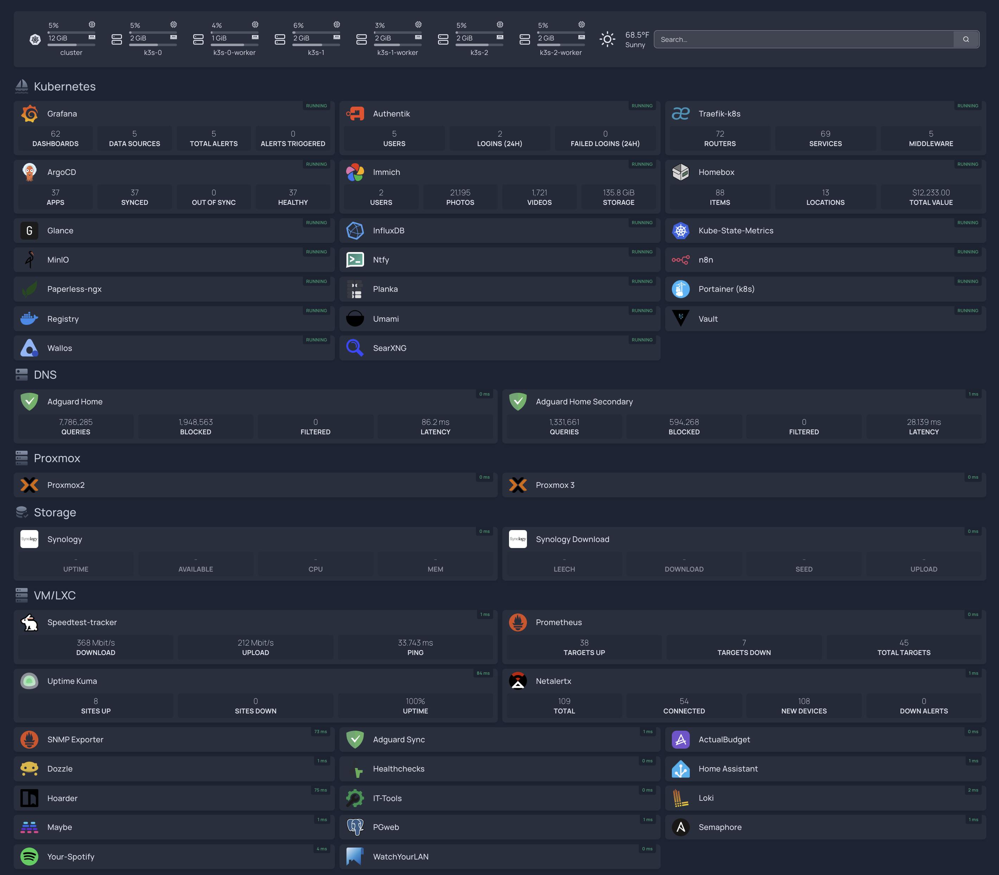

# My Personal Homelab

## Overview

I maintain a home lab environment for experimenting with infrastructure, automation, and self-hosted services. This setup allows me to gain hands-on experience with enterprise-grade tools and technologies while maintaining control over my personal data and services.

## Hardware Infrastructure

My current hardware setup includes:

## Compute Systems

- **Dell Optiplex 5000 PC**

  - Primary node running Proxmox VE
  - Hosts the main k3s cluster

- **Two Beelink Mini PCs**

  1. Secondary Proxmox VE node (clustered with Dell Optiplex)
  2. Dedicated container host running podman for various services and automation tasks

- **RaspberryPi 3**

  - not currently used mainly due to its performance limitations

- **HP Laptop**
  - Running Ubuntu Server
  - Used for testing and development tasks
  - [qdevice](https://blog.jenningsga.com/proxmox-keeping-quorum-with-qdevices/) for Proxmox HA

## Network & Storage

- **Synology NAS (DS923+)**

  - Primary network storage
  - Backup target for critical data

- **Network Equipment**
  - eero6 router & mesh network for reliable whole-home coverage
  - TP-Link unmanaged gigabit switch for high-speed local connectivity
  - APC UPS Pro 1500VA for power protection

## Software Stack

My lab runs a mix of containerized and traditional services:

## Infrastructure Services

- **Container Orchestration**: k3s Kubernetes cluster
- **Virtualization**: Proxmox VE cluster
- **Container Runtime**: Mix of Docker, Podman, and LXC containers
- **Remote Access**: [Tailscale](https://tailscale.com/) VPN for secure connectivity
- **Reverse Proxy**: [Traefik](https://traefik.io/) for service routing and SSL termination

## Authentication

- **Authentication**: [Authentik](https://www.authentik.io/) for identity and access management

## Automation Tools

- **GitOps**: [ArgoCD](https://argoproj.github.io/cd/) for automated deployments
- **Secrets Management**: [HashiCorp Vault](https://developer.hashicorp.com/vault) with [argocd-vault-plugin](https://github.com/argoproj-labs/argocd-vault-plugin)
- **Infrastructure as Code**: Terraform for cloud resource management
- **Configuration Management**: [Ansible](https://github.com/timmyb824/automation_ansible) for system provisioning and configuration
- **Shell Scripting**: Collection of [bash scripts](https://github.com/timmyb824/helper-scripts) for automation and adhoc tasks

## Monitoring System

Comprehensive monitoring stack including:

- [Prometheus](https://prometheus.io/) for metrics collection
- [Grafana](https://grafana.com/) for visualization
- [Netdata](https://netdata.cloud) for real-time performance monitoring
- [Uptime Kuma](https://github.com/louislam/uptime-kuma) for monitoring uptime of my public services
- [PingPulse](https://github.com/timmyb824/pingpulse) for monitoring the health of internal services (built by me)
- [Loki](https://grafana.com/oss/loki) for log management
- [Crowdsec](https://github.com/crowdsecurity/crowdsec) for security monitoring and prevention

## Network Management

- **DNS & Ad-blocking**: [AdGuard Home](https://github.com/AdguardTeam/AdGuardHome)
- **DNS Provider**: [Cloudflare](https://www.cloudflare.com/) for external resolution

## Cloud Services

I extend my homelab with [Oracle Cloud Infrastructure (OCI)](https://www.oracle.com/cloud/) for services that benefit from cloud hosting. This infrastructure is managed through [Terraform](https://www.terraform.io/) and [Terraform Cloud](https://app.terraform.io/session), taking advantage of OCI's generous free tier.

## Application Services

## Repository Overview

All configurations are version-controlled and publicly available:

- **[dotfiles](https://github.com/timmyb824/dotfiles)**: System configurations for Linux and macOS
- **[kubernetes-apps](https://github.com/timmyb824/kubernetes-apps)**: K8s manifests and Helm charts
- **[docker-apps](https://github.com/timmyb824/docker-apps)**: Container configurations
- **[automation-ansible](https://github.com/timmyb824/automation_ansible)**: System automation playbooks
- **[helper-scripts](https://github.com/timmyb824/helper-scripts)**: Utility scripts and tools
